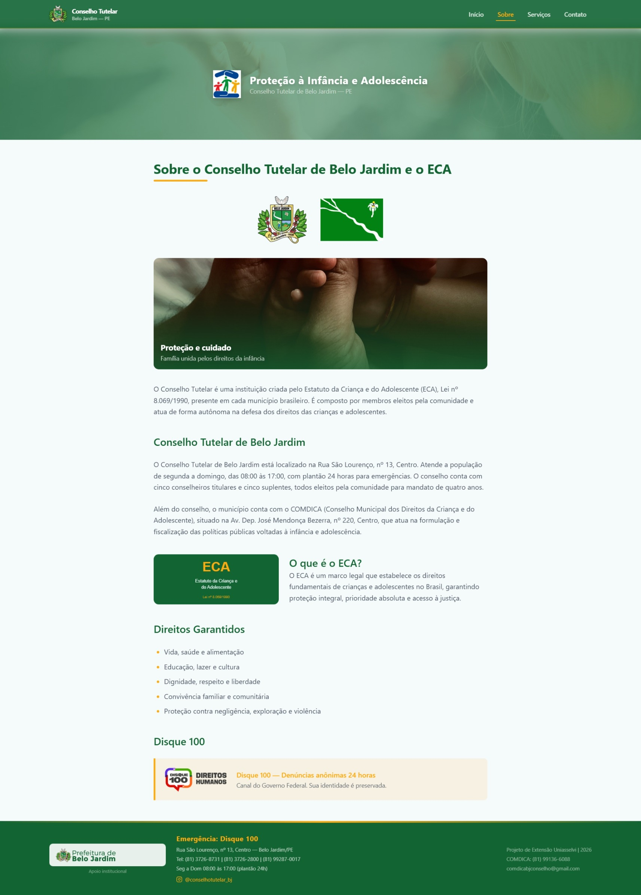
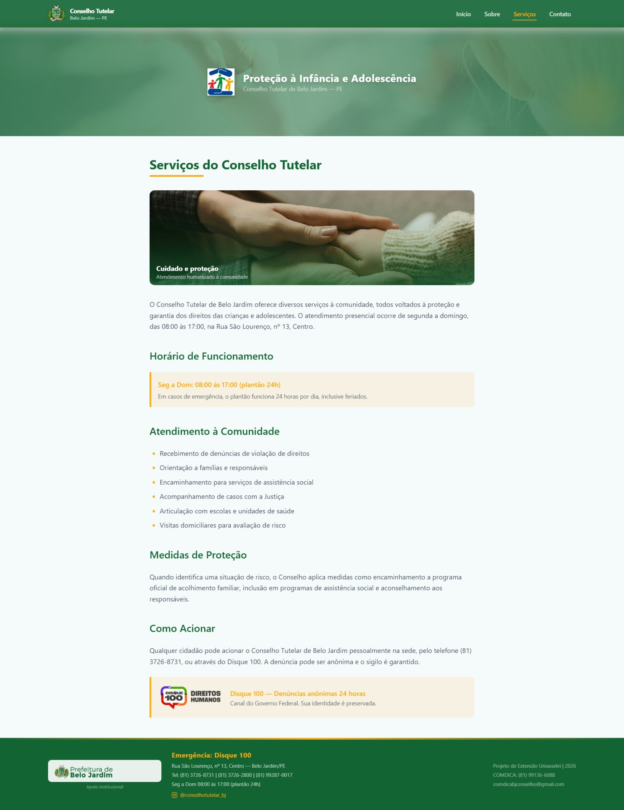
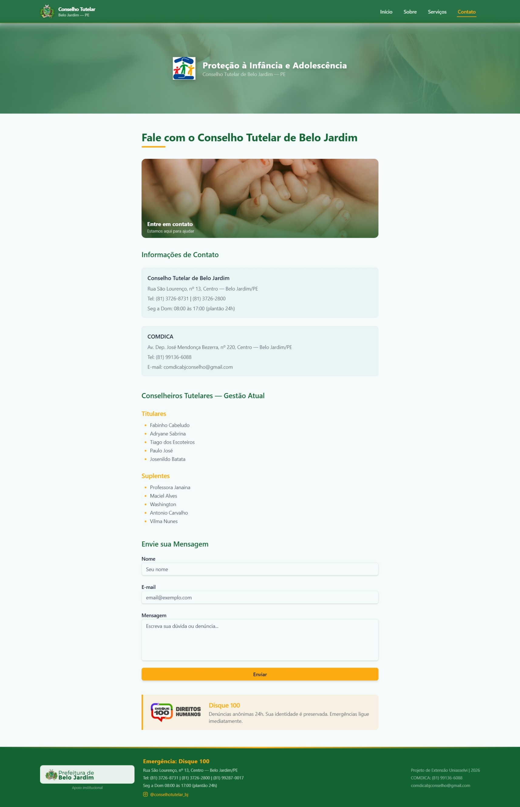
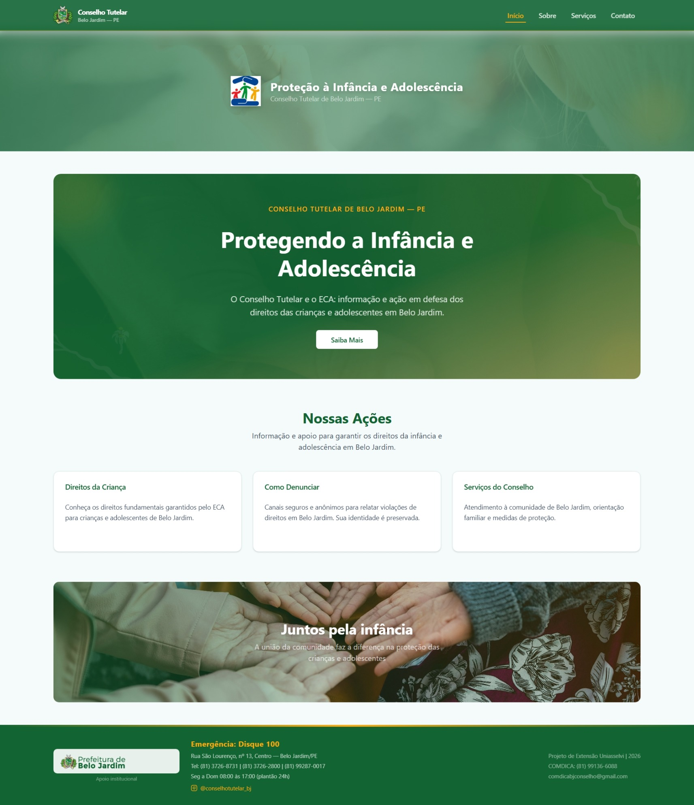
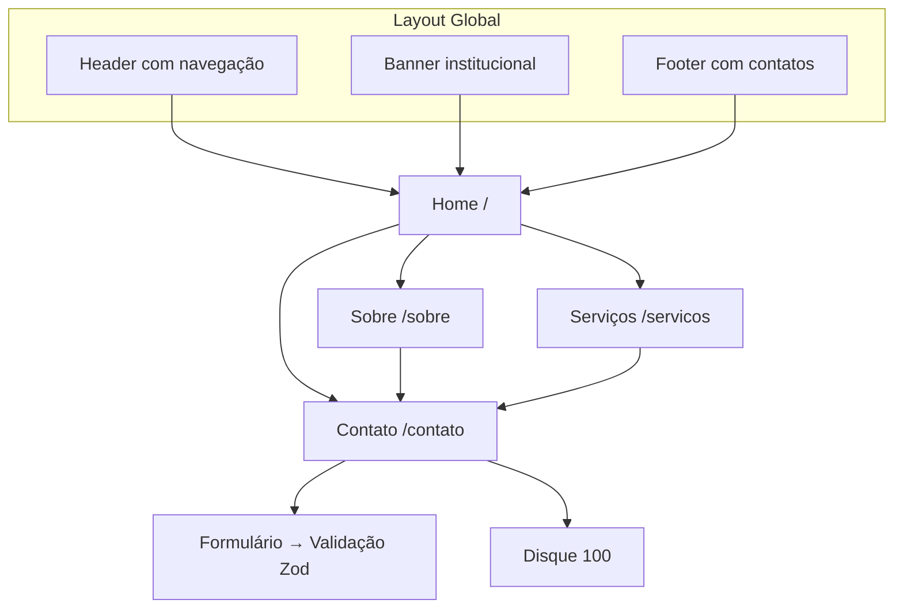

# Conselho Tutelar de Belo Jardim — Site Institucional

> Projeto de Extensão Universitária — UNIASSELVI (149h)

Site institucional estático do Conselho Tutelar de Belo Jardim – PE, desenvolvido como atividade prática do curso de extensão. O site apresenta informações sobre o Conselho, o Estatuto da Criança e do Adolescente (ECA), serviços prestados e canais de denúncia como o Disque 100.

[](README_EN.md)

---

## 🔨 Funcionalidades

- **Página Inicial** — Hero section animada + cards informativos com indicadores visuais
- **Sobre** — História do Conselho Tutelar e do ECA, brasão, bandeira, selo do ECA e Disque 100
- **Serviços** — Horários de funcionamento, lista de serviços e medidas de proteção
- **Contato** — Endereços reais, telefones, conselheiros titulares/suplentes, formulário validado com React Hook Form + Zod
- **Formulário de Contato** — Validação em tempo real com feedback visual
- **Footer** — Informações institucionais, COMDICA, telefones e link para Instagram
- **Design Responsivo** — Adaptável a mobile, tablet e desktop
- **Animações** — Fade-in, shimmer, float, pulse-glow e gradient shift

### 📸 Screenshots

<div align="center">
  
  
  
  
</div>

## ✔️ Técnicas e Tecnologias

| Categoria | Tecnologias |
|-----------|-------------|
| **Framework** | Next.js 16 (App Router, Static Generation) |
| **Linguagem** | TypeScript |
| **Estilização** | Tailwind CSS v4 + `tailwindcss-animate` |
| **UI Components** | shadcn/ui (Button, Card, Form, Input, Label, Textarea) |
| **Formulário** | React Hook Form + @hookform/resolvers + Zod |
| **Testes** | Vitest + @testing-library/react |
| **Linter/Formatador** | Biome |
| **Ícones** | Lucide React |
| **Imagens** | Pexels (fotos gratuitas), Wikimedia Commons, SVG customizados |
| **Deploy** | Vercel (Static Export) |

## 📊 Fluxo de Navegação



## 📁 Estrutura do Projeto

```
src/
├── app/                    # Páginas (App Router)
│   ├── contato/page.tsx    # Página de contato
│   ├── servicos/page.tsx   # Página de serviços
│   ├── sobre/page.tsx      # Página sobre o Conselho e ECA
│   ├── globals.css         # Estilos globais e temas
│   ├── layout.tsx          # Layout raiz (Header + Banner + Footer)
│   └── page.tsx            # Home
├── components/
│   ├── Header.tsx          # Cabeçalho com navegação
│   ├── Footer.tsx          # Rodapé institucional
│   ├── HeroSection.tsx     # Seção hero da Home
│   ├── InfoCard.tsx        # Card informativo
│   ├── ContactForm.tsx     # Formulário de contato validado
│   └── ui/                 # Componentes shadcn/ui
├── lib/
│   └── utils.ts            # Utilitários
├── __tests__/              # Testes unitários (Vitest)
```

## 🛠️ Abrir e Rodar o Projeto

1. **Pré-requisito**: Node.js 18+

   ```bash
   node -v
   ```

2. **Clone o repositório**:

   ```bash
   git clone <URL_DO_REPOSITORIO>
   cd tutelary-council-website
   ```

3. **Instale as dependências**:

   ```bash
   npm install
   ```

4. **Inicie o servidor de desenvolvimento**:

   ```bash
   npm run dev
   ```

   Acesse [http://localhost:3000](http://localhost:3000).

5. **Build de produção**:

   ```bash
   npm run build
   ```

6. **Executar testes**:

   ```bash
   npm test
   ```

## 🌐 Deploy

O projeto é estático e pode ser deployado em qualquer plataforma de hospedagem estática.

**Deploy na Vercel** (recomendado):

```bash
vercel --prod
```

Ou conecte o repositório GitHub à [Vercel](https://vercel.com) — a plataforma detecta Next.js automaticamente.

---

## 📄 Licença

Projeto acadêmico sem fins comerciais. Dados institucionais reais do Conselho Tutelar de Belo Jardim – PE.
