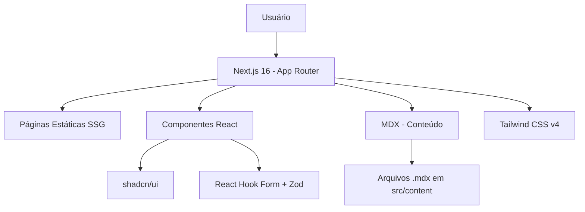

# Conselho Tutelar — Site Institucional

[](README.md)
[](README_EN.md)

> Site institucional desenvolvido como **Projeto de Extensão Universitária** para o curso de Análise e Desenvolvimento de Sistemas da **UNIASSELVI**.
>
> **ODS 16** — Paz, justiça e instituições eficazes.

## 🔨 Funcionalidades do Projeto

- **Home** — Hero section com CTA e cards das ações sociais
- **Sobre o ECA** — Conteúdo informativo sobre o Estatuto da Criança e do Adolescente
- **Notícias** — Blog com conteúdo em MDX, geração de páginas estáticas (SSG)
- **Contato** — Formulário com validação via React Hook Form + Zod
- **Disque 100** — Destaque do canal de denúncias anônimas

### 📸 Exemplo Visual do Projeto

<div align="center">
  
  
</div>

## ✔️ Técnicas e Tecnologias Utilizadas

| Camada | Tecnologia |
| :----- | :--------- |
| Framework | Next.js 16 (App Router) |
| Linguagem | TypeScript (strict) |
| Estilização | Tailwind CSS v4 |
| Componentes | shadcn/ui (acessíveis, headless) |
| Conteúdo | MDX + next-mdx-remote |
| Formulário | React Hook Form + Zod |
| Testes | Vitest + Testing Library |
| Qualidade | Biome (lint + format) |
| Deploy | Vercel |

## 📊 Diagrama da Arquitetura



## 📁 Estrutura do Projeto

```
src/
├── app/                    # Rotas do Next.js App Router
│   ├── globals.css        # Estilos globais + tokens shadcn/ui
│   ├── layout.tsx         # Layout raiz (Header + Footer)
│   ├── page.tsx           # Home
│   ├── sobre-eca/         # Página institucional do ECA
│   ├── contato/           # Página de contato
│   └── noticias/
│       ├── page.tsx       # Listagem de notícias
│       └── [slug]/        # Notícia individual (SSG)
├── components/
│   ├── ui/                # shadcn/ui (button, card, form, input, label, textarea)
│   ├── Header.tsx
│   ├── Footer.tsx
│   ├── HeroSection.tsx
│   ├── ActionCard.tsx
│   └── ContactForm.tsx
├── content/noticias/       # Arquivos MDX das notícias
├── lib/utils.ts            # Função cn() para merge de classes
└── __tests__/              # Testes com Vitest
```

## 🛠️ Abrir e Rodar o Projeto

### Pré-requisitos

- Node.js 18+ (recomendado 22+)

```bash
node -v
```

### Passos

```bash
# 1. Clone o repositório
git clone <URL_DO_REPOSITORIO>
cd tutelary-council-website

# 2. Instale as dependências
npm install

# 3. Inicie o servidor de desenvolvimento
npm run dev

# 4. Acesse http://localhost:3000
```

### Scripts Disponíveis

| Comando | Descrição |
| :------ | :-------- |
| `npm run dev` | Inicia servidor de desenvolvimento |
| `npm run build` | Gera build de produção |
| `npm run start` | Inicia servidor de produção |
| `npm test` | Executa testes (Vitest) |
| `npm run test:watch` | Testes em modo watch |
| `npm run lint` | Verifica código com Biome |
| `npm run format` | Formata código com Biome |
| `npm run typecheck` | Verificação de tipos TypeScript |

## 🌐 Deploy

O deploy pode ser feito na **Vercel**:

1. Crie um repositório no GitHub
2. Faça push do código
3. Acesse [vercel.com](https://vercel.com) e importe o repositório
4. Framework detectado automaticamente como Next.js
5. Deploy automático a cada `git push`

---

<div align="center">
  <p><strong>Projeto de Extensão Universitária — UNIASSELVI 2026</strong></p>
  <p>Curso de Análise e Desenvolvimento de Sistemas</p>
</div>
