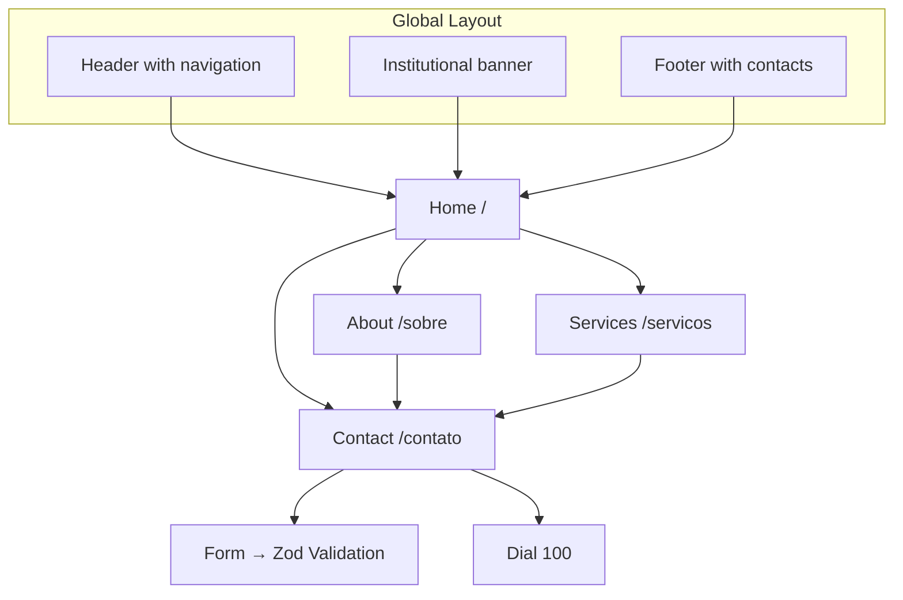

# Conselho Tutelar de Belo Jardim — Institutional Website

> University Extension Project — UNIASSELVI (149h)

Static institutional website for the Child Protection Council (Conselho Tutelar) of Belo Jardim – PE, Brazil. Developed as a practical activity for the university extension program. The site presents information about the Council, the Child and Adolescent Statute (ECA), services provided, and reporting channels such as Dial 100 (Disque 100).

[](README.md)

---

## 🔨 Features

- **Home Page** — Animated hero section + informational cards with visual indicators
- **About** — History of the Child Protection Council and ECA, coat of arms, flag, ECA badge, and Dial 100
- **Services** — Business hours, service list, and protective measures
- **Contact** — Real addresses, phone numbers, council members, validated form with React Hook Form + Zod
- **Contact Form** — Real-time validation with visual feedback
- **Footer** — Institutional info, COMDICA, phone numbers, and Instagram link
- **Responsive Design** — Adapts to mobile, tablet, and desktop
- **Animations** — Fade-in, shimmer, float, pulse-glow, and gradient shift

### 📸 Screenshots

<div align="center">
  
  
  
  
</div>

## ✔️ Techniques & Technologies

| Category | Technologies |
|----------|-------------|
| **Framework** | Next.js 16 (App Router, Static Generation) |
| **Language** | TypeScript |
| **Styling** | Tailwind CSS v4 + `tailwindcss-animate` |
| **UI Components** | shadcn/ui (Button, Card, Form, Input, Label, Textarea) |
| **Forms** | React Hook Form + @hookform/resolvers + Zod |
| **Testing** | Vitest + @testing-library/react |
| **Linter/Formatter** | Biome |
| **Icons** | Lucide React |
| **Images** | Pexels (free photos), Wikimedia Commons, custom SVGs |
| **Deploy** | Vercel (Static Export) |

## 📊 Navigation Flow



## 📁 Project Structure

```
src/
├── app/                    # Pages (App Router)
│   ├── contato/page.tsx    # Contact page
│   ├── servicos/page.tsx   # Services page
│   ├── sobre/page.tsx      # About page
│   ├── globals.css         # Global styles & themes
│   ├── layout.tsx          # Root layout (Header + Banner + Footer)
│   └── page.tsx            # Home page
├── components/
│   ├── Header.tsx          # Navigation header
│   ├── Footer.tsx          # Institutional footer
│   ├── HeroSection.tsx     # Home hero section
│   ├── InfoCard.tsx        # Info card component
│   ├── ContactForm.tsx     # Validated contact form
│   └── ui/                 # shadcn/ui components
├── lib/
│   └── utils.ts            # Utilities
├── __tests__/              # Unit tests (Vitest)
```

## 🛠️ How to Run

1. **Prerequisite**: Node.js 18+

   ```bash
   node -v
   ```

2. **Clone the repository**:

   ```bash
   git clone <REPO_URL>
   cd tutelary-council-website
   ```

3. **Install dependencies**:

   ```bash
   npm install
   ```

4. **Start the development server**:

   ```bash
   npm run dev
   ```

   Open [http://localhost:3000](http://localhost:3000).

5. **Production build**:

   ```bash
   npm run build
   ```

6. **Run tests**:

   ```bash
   npm test
   ```

## 🌐 Deploy

The project generates static pages and can be deployed to any static hosting platform.

**Deploy to Vercel** (recommended):

```bash
vercel --prod
```

Or connect the GitHub repository to [Vercel](https://vercel.com) — the platform auto-detects Next.js.

---

## 📄 License

Academic project for non-commercial purposes. Real institutional data from Conselho Tutelar de Belo Jardim – PE, Brazil.
