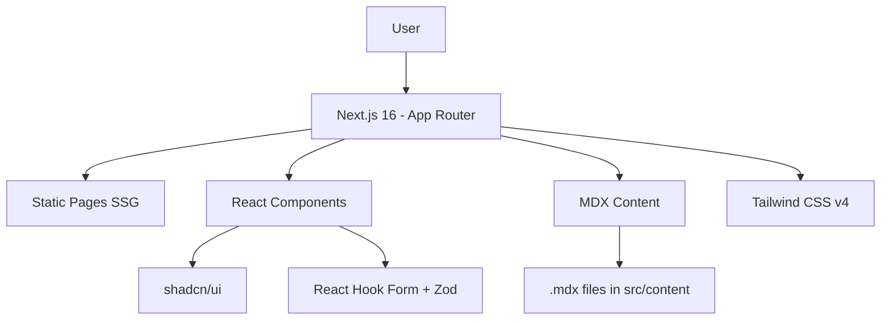

# Tutelary Council — Institutional Website

[](README.md)
[](README_EN.md)

> Institutional website developed as a **University Extension Project** for the Systems Analysis and Development course at **UNIASSELVI**.
>
> **SDG 16** — Peace, justice and strong institutions.

## 🔨 Features

- **Home** — Hero section with CTA and social action cards
- **About ECA** — Informational content about the Child and Adolescent Statute
- **News** — MDX-powered blog with static site generation (SSG)
- **Contact** — Form with validation via React Hook Form + Zod
- **Disque 100** — Anonymous whistleblower channel highlight

### 📸 Visual Preview

<div align="center">
  
  
</div>

## ✔️ Technologies

| Layer | Technology |
| :---- | :--------- |
| Framework | Next.js 16 (App Router) |
| Language | TypeScript (strict) |
| Styling | Tailwind CSS v4 |
| Components | shadcn/ui (accessible, headless) |
| Content | MDX + next-mdx-remote |
| Forms | React Hook Form + Zod |
| Testing | Vitest + Testing Library |
| Quality | Biome (lint + format) |
| Deploy | Vercel |

## 📊 Architecture Diagram



## 📁 Project Structure

```
src/
├── app/                    # Next.js App Router routes
│   ├── globals.css        # Global styles + shadcn/ui tokens
│   ├── layout.tsx         # Root layout (Header + Footer)
│   ├── page.tsx           # Home page
│   ├── sobre-eca/         # ECA institutional page
│   ├── contato/           # Contact page
│   └── noticias/
│       ├── page.tsx       # News listing
│       └── [slug]/        # Individual news (SSG)
├── components/
│   ├── ui/                # shadcn/ui (button, card, form, input, label, textarea)
│   ├── Header.tsx
│   ├── Footer.tsx
│   ├── HeroSection.tsx
│   ├── ActionCard.tsx
│   └── ContactForm.tsx
├── content/noticias/       # MDX news files
├── lib/utils.ts            # cn() utility for class merging
└── __tests__/              # Vitest tests
```

## 🛠️ Getting Started

### Prerequisites

- Node.js 18+ (recommended 22+)

```bash
node -v
```

### Steps

```bash
# 1. Clone the repository
git clone <REPO_URL>
cd tutelary-council-website

# 2. Install dependencies
npm install

# 3. Start development server
npm run dev

# 4. Open http://localhost:3000
```

### Available Scripts

| Command | Description |
| :------ | :---------- |
| `npm run dev` | Start development server |
| `npm run build` | Build for production |
| `npm run start` | Start production server |
| `npm test` | Run tests (Vitest) |
| `npm run test:watch` | Watch mode tests |
| `npm run lint` | Lint with Biome |
| `npm run format` | Format with Biome |
| `npm run typecheck` | TypeScript type check |

## 🌐 Deploy

Deploy on **Vercel**:

1. Create a GitHub repository
2. Push the code
3. Go to [vercel.com](https://vercel.com) and import the repository
4. Framework auto-detected as Next.js
5. Automatic deploy on every `git push`

---

<div align="center">
  <p><strong>University Extension Project — UNIASSELVI 2026</strong></p>
  <p>Systems Analysis and Development Course</p>
</div>
